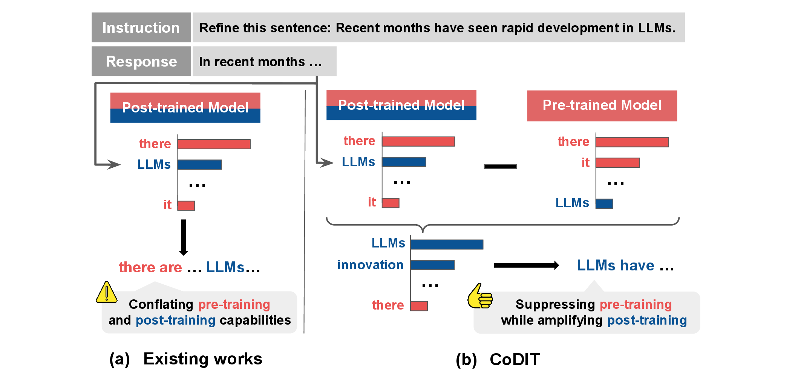

<div align="center">
  <h1>Synthesizing Instruction-Tuning Datasets with Contrastive Decoding</h1>

  <p>
    Tatsuya Ichinose · Youmi Ma · Masanari Oi · Ryuto Koike · Naoaki Okazaki
    <br>
    <strong>Accepted to the Third Conference on Language Modeling (COLM 2026) 🇺🇸</strong>
  </p>

  <a href="figs/figure.pdf">
    
  </a>

  <p>
    <a href="https://arxiv.org/abs/2604.13538">📑 Paper</a>
    &nbsp;|&nbsp;
    <a href="https://huggingface.co/datasets/Tatsuya-Ichinose/CoDIT">🤗 Datasets</a>
    &nbsp;|&nbsp;
    <a href="https://github.com/Tatsuya736482/contrastive_decoding_public">💻 Code</a>
  </p>

</div>

Welcome to the official repository for
**[Synthesizing Instruction-Tuning Datasets with Contrastive Decoding](https://arxiv.org/abs/2604.13538)**.
This repository contains the generation code and patches for **vLLM 0.11.0**
used to apply CoDIT and synthesize response data for instruction tuning. The
datasets synthesized with CoDIT are publicly available on
[Hugging Face](https://huggingface.co/datasets/Tatsuya-Ichinose/CoDIT).

As illustrated above, conventional response synthesis (a) uses only a post-trained
model, producing responses that mix capabilities acquired during pre-training
and post-training. CoDIT (b) instead contrasts the output distributions of the
post-trained model and its pre-trained counterpart, suppressing shared
pre-training capabilities while emphasizing the instruction-following
capabilities acquired during post-training.

| Dataset | Teacher model | Responses |
| --- | --- | ---: |
| [CoDIT-Gemma3 🤗](https://huggingface.co/datasets/Tatsuya-Ichinose/CoDIT-Gemma3) | `Gemma 3 27B IT` | 250,333 |
| [CoDIT-Qwen3-8B 🤗](https://huggingface.co/datasets/Tatsuya-Ichinose/CoDIT-Qwen3-8B) | `Qwen3 8B` | 250,333 |
| [CoDIT-Qwen3-30B 🤗](https://huggingface.co/datasets/Tatsuya-Ichinose/CoDIT-Qwen3-30B) | `Qwen3 30B` | 250,333 |

## News

- **[2026-07]** CoDIT was accepted to COLM 2026.
- **[2026-04]** The CoDIT paper was released on arXiv.
- **[2026-01]** The CoDIT-LMSYS datasets were released on Hugging Face.


## Installation

### 1. Create the environment

```bash
git clone https://github.com/Tatsuya736482/contrastive_decoding_public.git
cd contrastive_decoding_public

python -m venv .venv
source .venv/bin/activate
python -m pip install --upgrade pip
python -m pip install -r requirements.txt
```

> [!IMPORTANT]
> The sampler and scheduler patches target **vLLM 0.11.0**. Other versions may
> have incompatible internal APIs. For the complete package versions used in
> the development environment, install `requirements-freeze.txt` instead.

> [!WARNING]
> This repository contains research code intended for reproducing the CoDIT
> experiments in a trusted environment. Some scripts start local coordination
> or vLLM services on all network interfaces without authentication. When
> running the code on a shared machine or network, restrict access to the
> relevant ports.

### 2. Log in to Hugging Face

```bash
hf auth login
```

Some models are gated. Accept their license terms on Hugging Face before
running the corresponding script.

> [!TIP]
> CoDIT loads the Expert and Amateur simultaneously. If each model uses tensor
> parallel size `N`, CoDIT requires `2 × N` GPUs. Standard decoding requires
> only `N` GPUs. The two models must have compatible tokenizers and
> vocabularies because their token-level distributions are contrasted directly.

## Quickstart

The recommended example runs CoDIT with Qwen3-8B, assigning one GPU each to
the Expert and Amateur. To customize GPU usage, edit `tensor_parallel_size` and
the `CUDA_VISIBLE_DEVICES_*` variables in the corresponding script.

```bash
bash scripts/run_Qwen3-8B.sh
```


The command reads `data/example.jsonl` and writes:

```text
outputs/example-Qwen3-8B-CoDIT.jsonl
```

Logs are written separately for the Expert, Amateur, and coordinator:

```text
logs/
├── expert/Qwen/Qwen3-8B/
├── amateur/Qwen/Qwen3-8B/
└── coord/Qwen/Qwen3-8B/
```

## Supported Models

- [google/gemma-3-27b-it](scripts/run_gemma-3-27b.sh)
- [Qwen/Qwen3-8B](scripts/run_Qwen3-8B.sh)
- [Qwen/Qwen3-30B-A3B](scripts/run_Qwen3-30B-A3B.sh)
- [meta-llama/Llama-3.1-8B-Instruct](scripts/run_Llama-3.1-8B.sh)
- [meta-llama/Llama-3.2-1B-Instruct](scripts/run_Llama-3.2-1B.sh)
- [meta-llama/Llama-3.2-3B-Instruct](scripts/run_Llama-3.2-3B.sh)
- [allenai/Olmo-3-7B-Instruct](scripts/run_Olmo-3-7B-Instruct.sh)
- [allenai/Olmo-3-7B-Instruct-SFT](scripts/run_Olmo-3-7B-Instruct-SFT.sh)

## Example data license

`data/example.jsonl` is a subset of instructions sampled from
[allenai/WildChat-1M](https://huggingface.co/datasets/allenai/WildChat-1M).
WildChat-1M is distributed under the
[Open Data Commons Attribution License (ODC-By)](https://opendatacommons.org/licenses/by/1-0/).

The judge prompt for the Best-of-N baseline in
[`scripts/prompts/judge_prompts.jsonl`](scripts/prompts/judge_prompts.jsonl) is
adapted from [WildBench](https://github.com/allenai/WildBench), which is
distributed under the Apache License 2.0.

## License

Unless otherwise noted, the code in this repository is licensed under the
[Apache License 2.0](LICENSE). Dataset samples and third-party materials remain
subject to their respective licenses described above.

## Citation

If you find the paper, data, or code useful, please cite:

```bibtex
@inproceedings{ichinose2026synthesizing,
  title     = {Synthesizing Instruction-Tuning Datasets with Contrastive Decoding},
  author    = {Ichinose, Tatsuya and Ma, Youmi and Oi, Masanari and Koike, Ryuto and Okazaki, Naoaki},
  booktitle = {Third Conference on Language Modeling},
  year      = {2026},
  month     = oct,
  address   = {San Francisco, United States of America},
  url       = {https://arxiv.org/abs/2604.13538}
}
```
